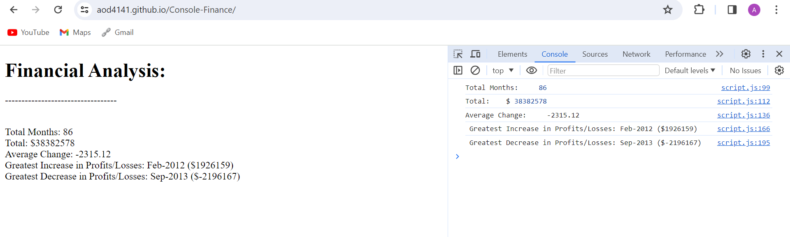

# Console-Finance-Challenge
The purpose is to create code that analyse financial records using a financial dataset.

## Table of Contents

* Individual solution to each question

## Features

Javascript functions and methods, computed Total Months, Total, Average Change, Greatest Increase (month and year) Profits/Losses and Greatest Decrease (month and year) Profits/Losses

## Screenshot of the results

## Link to page

https://aod4141.github.io/Console-Finance/

## Link to repo

https://github.com/AOD4141/Console-Finance

## Authors

- [GitHub - Adebayo Dada](https://github.com/AOD4141)

## License

- This application is covered under: [MIT License](https://choosealicense.com/licenses/mit)
